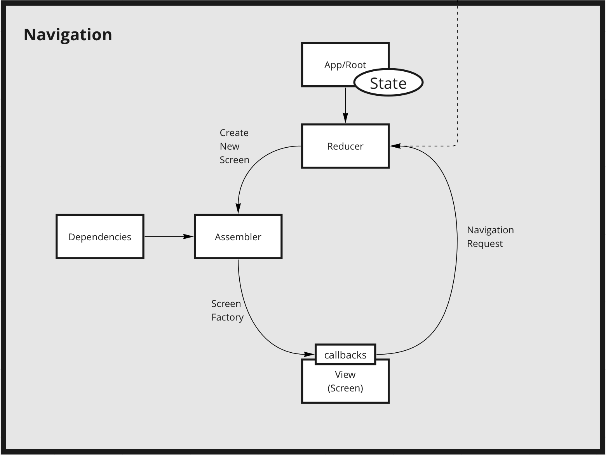

# Navidux 

[](https://swift.org/package-manager)
[](https://developer.apple.com/swift)

Navidux is easy and simple module to build your navigation without thinking about complicated routes in factories.

## Table of Contents
- [Navidux](#navidux)
  - [Table of Contents](#contents)
  - [About Navidux](#about-navidux)
  - [Requirements](#requirements)
  - [Installation](#installation)
    - [Preparation](#preparation)
  - [Usage](#usage)
    - [Initialisation phase](#initialisation-phase)
    - [Using phase](#using-phase)
  - [Roadmap](#roadmap)

## About Navidux
We create this package with router to facilitate routing duties and improve reading in complicated projects. Analyzing previous project give us idea of creating independently navigation. It's did not depend on your project and may use in different combination and variations. Of course it can uses with Storyboard, UIKit and SwiftUI screens. 
The goals we want to achieve:
- Easy using and create routes in screen modules.
- Use with most architectual approaches (MVVM, MVC, VIPER, MVI, MVP etc).
- Not complicated logic of library engine.



Coordinator core consists from: 
- Reducer function - ``actionReducer(action:)``; 
- ScreenAssembler - that implements in navigation depended module; 
- State - contains important properties for better functionality;
- NavigationController - component that directry implements routing and hold some important information, like Screen Stack.
Most core components have documentation on the spot with some examples.

## Requirements
- iOS 13.0+

## Installation
Swift Package Manager

Swift Package Manager is a tool for managing the distribution of Swift code. It’s integrated with the Swift build system to automate the process of downloading, compiling, and linking dependencies.

Xcode 11+ is required to build Navidux using Swift Package Manager.
To integrate Navidux into your Xcode project using Swift Package Manager, add it to the dependencies value of your Package.swift:
``` swift
dependencies: [
    .package(url: "https://github.com/RedMadRobot/navidux.git")
]
```

### Preparation
Next you have to extends 2 object and implement 1 to use Navidux at maximum. Some were in your APP module extends:
``` swift
extension NaviduxScreen {
    static let newScreen = NaviduxScreen(
        description: "someDescription",
        screenClass: YourScreenTypeInheritedFromUIViewController.self
    )
}
```
``` swift
extension Navidux.ScreenFactory {
public var someScreenFactory: (Coordinator?, ScreenConfig) -> any NavigationScreen {
    { coordinator, config
        return MyViewControllerConformedNavigationScreen()
    }
}
```

And implement Navidux.ScreenAssembler protocol.

## Usage
### Initialisation phase
To set Navidux as initial navigation controller. You need do installation and preparation phases.  After you may initialise Coordinator like example below. 
``` swift
let navigationController = NavigationControllerImpl()
let screenFactory: ScreenFactory = NaviduxScreenFactory()
let alertFactory: AlertFactory = AlertFactoryImpl()
let navigationCoordinatorProxy = NavigationCoordinatorProxy()
let screenAssembler = NaviduxScreenAssembler(
    screenFactory: screenFactory,
    alertFactory: alertFactory,
    screenCoordinator: navigationCoordinatorProxy
)

let navigationCoordinator = NavigationCoordinator(
    navigationController,
    screenAssembler: screenAssembler
)
navigationCoordinatorProxy.subject = navigationCoordinator
navigationCoordinator.actionReducer(
    action: .push(.firstScreen, .init(navigationTitle: ""), .fullscreen)
)

window?.rootViewController = navigationController
```

### Using phase
For example in your UIViewController you may call Coordinator and ask it for action: 
``` swift
navigation?.actionReducer(
    action: .push(.nextScreen, .init(navigationTitle: "My title"), .fullscreen)
)
```

## Roadmap

